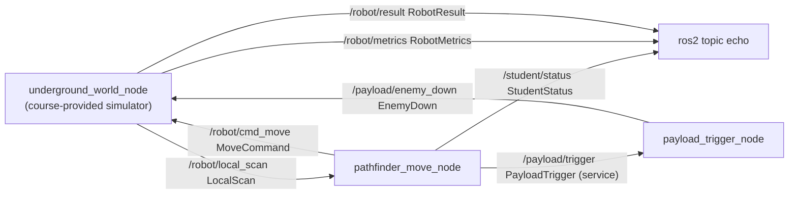

# ros_hallway_pathfinder

A ROS 2 (Jazzy, C++20) system in which a robot explores an unknown grid of hallways and rooms, charts it from short-range scans, and neutralises every enemy contact it finds. The robot does not know the map in advance. It only receives what its scanner sees around it.

The mission succeeds when every passable cell has been seen and every contact has been processed. Returning to the start is not required.

## System



| Node | Owner | Role |
|---|---|---|
| `underground_world_node` | course | Loads a scenario, publishes scans, applies moves and enemy-down reports, tracks metrics and the final result. |
| `pathfinder_move_node` | student | Subscribes to scans, decides the next move or the next engagement, publishes moves and status. |
| `payload_trigger_node` | student | Serves `/payload/trigger` and reports the neutralised contact on `/payload/enemy_down`. |

## Interfaces

| Name | Type | Fields |
|---|---|---|
| `/robot/local_scan` | `msg/LocalScan` | `scenario_name`, `robot_x`, `robot_y`, `cells[]` of `CellObservation` (`x`, `y`, `cell_type`, `contact_id`) |
| `/robot/cmd_move` | `msg/MoveCommand` | `direction` (`UP=0`, `DOWN=1`, `LEFT=2`, `RIGHT=3`) |
| `/student/status` | `msg/StudentStatus` | `state` (`EXPLORING`, `ENGAGING`, `RETURNING`, `DONE`, `FAILED`) |
| `/payload/trigger` | `srv/PayloadTrigger` | request `contact_id`, `x`, `y`; response `accepted`, `reason` |
| `/payload/enemy_down` | `msg/EnemyDown` | `contact_id`, `x`, `y` |
| `/robot/metrics` | `msg/RobotMetrics` | steps, invalid moves, contacts seen and down, invalid and duplicate triggers, unique cells seen, `map_coverage_percent` |
| `/robot/result` | `msg/RobotResult` | `mission_result`, `reason`, `steps_taken`, `max_steps` |

Cell types in a scan: `#` wall, `.` free, `S` start, `C` contact, `x` a contact that has already been processed.

## Pathfinding algorithm

The logic lives in `PathfinderService` (`pathfinder_service.cpp`) and `WorldMap` (`world_model.cpp`), with no ROS dependency. `pathfinder_move_node` only converts messages to these types and back.

Each scan triggers one decision:

1. **Chart:** merge the scan into the known map, a hash map from position to `ObservedCell`. Keep the robot position.
2. **Engage first:** if any known passable cell is a `Contact`, return `ENGAGING` with that cell. The node then calls `/payload/trigger` and does not move this step.
3. **Otherwise explore:** find the nearest **frontier** and take the first step toward it.
4. **Nothing left:** if no frontier is reachable, return `DONE`.

**Frontier:** a known non-wall cell with at least one orthogonal neighbour that is not yet in the map. Only one unknown neighbour is needed, and a charted wall neighbour does not count. A frontier stops being one as soon as its neighbours have been seen, so no separate visited set is needed, and the map is fully explored exactly when there are no frontiers left.

**One breadth-first search does both jobs:**

- BFS runs from the robot over known non-wall cells, recording each cell's parent and distance. Distances follow real corridors, so a frontier behind a wall is never mistaken for a near one, and frontiers the search cannot reach are skipped.
- The frontier with the smallest BFS distance wins. Ties are broken by `(x, y)` order, so behaviour is deterministic.
- The path to it is recovered from the parent links, and its first step becomes the `MoveCommand`.

Choosing the nearest frontier makes the robot dive down the current corridor before backtracking. When a junction leaves two equidistant options, the tie-break only sets the order, because the robot has to come back for the other branch either way.

**Seeing is not visiting.** The scanner has radius 1 (a 3x3 window), so the robot does not have to step on every cell to see it. But the scenarios use one-cell-wide corridors separated by one-cell walls, so in practice the robot has to walk down nearly every corridor anyway.

## Scenarios

YAML files in `config/`, each with `max_steps`, `scan_radius` and a character grid (`#` wall, `.` free, `S` start, `C` contact). Every move command counts against the budget, including invalid ones.

| Scenario | `max_steps` |
|---|---|
| `training_corridor` (default) | 80 |
| `small_rooms` | 140 |
| `branching_trench` | 180 |
| `dead_end_bunker` | 220 |

The world reports `SUCCESS` when all passable cells have been seen and all contacts processed, and `FAILED_MAX_STEPS` when the command budget runs out. A trigger is rejected (and counted in the metrics) if the contact does not exist at the given position, was already processed, or is not visible from the robot's position. An unprocessed contact blocks movement until it is handled.

## Build and run

The project is meant to run inside its devcontainer (`osrf/ros:jazzy-desktop` with CycloneDDS). Open the folder in VS Code and choose "Reopen in Container".

```sh
cd robot_ws
source /opt/ros/jazzy/setup.bash
colcon build --cmake-args -DCMAKE_BUILD_TYPE=Debug
source install/setup.bash

ros2 launch underground_world system.launch.py
ros2 launch underground_world system.launch.py scenario:=dead_end_bunker.yaml
ros2 launch underground_world system.launch.py scenario:=small_rooms.yaml move_commit_period_ms:=20
```

Launch arguments: `scenario` (a YAML file in `config/`, default `training_corridor.yaml`) and `move_commit_period_ms` (delay before a queued move is applied, default 50).

Watch a run:

```sh
ros2 topic echo /robot/result
ros2 topic echo /robot/metrics
ros2 topic echo /student/status
```

**Tests:**

```sh
colcon test --packages-select underground_world
colcon test-result --verbose
```

`provided_world_contract_test` covers the course-provided simulator only: scenario validity, stable one-based contact ids, invalid-move counting, processed contacts shown as `x`, contacts blocking movement until processed, and success not requiring a return to the start. There are no unit tests for `PathfinderService` yet.

## Recording proof bags

`robot_ws/scripts/record_bags.sh` runs each of the four scenarios in turn, records all topics for 12 seconds with `ros2 bag record`, and writes them to `bags/<scenario>/` at the repo root. Build first:

```sh
cd robot_ws
colcon build --packages-select underground_world
bash scripts/record_bags.sh
```

Bags are gitignored.

## VS Code

- Tasks: `ROS2: colcon build` and `ROS2: build + launch system` (default build task, runs `dead_end_bunker`).
- A GDB launch config for `underground_world_node`.
- clangd reads `robot_ws/build/compile_commands.json`, so run a colcon build first for the ROS headers to resolve.

## Layout

```text
.devcontainer/          ROS 2 Jazzy image, CycloneDDS config, post-start daemon reset
.vscode/                tasks, launch config, clangd settings
robot_ws/
  scripts/record_bags.sh
  src/underground_world/
    msg/  srv/          interface definitions
    config/             scenario YAMLs
    launch/system.launch.py
    include/underground_world/
      pathfinder_service.hpp        exploration logic (student)
      world_model.hpp, scenario.hpp,
      scenario_loader.hpp           simulator model (course-provided)
    src/                three node executables plus the core library sources
    test/
```

The course-provided files are the simulator: `underground_world_node.cpp`, `world_model.cpp`, `scenario_loader.cpp`, the scenario headers, the YAML scenarios and the contract test. The student-owned files are `pathfinder_move_node.cpp`, `pathfinder_service.cpp/.hpp` and `payload_trigger_node.cpp`.
